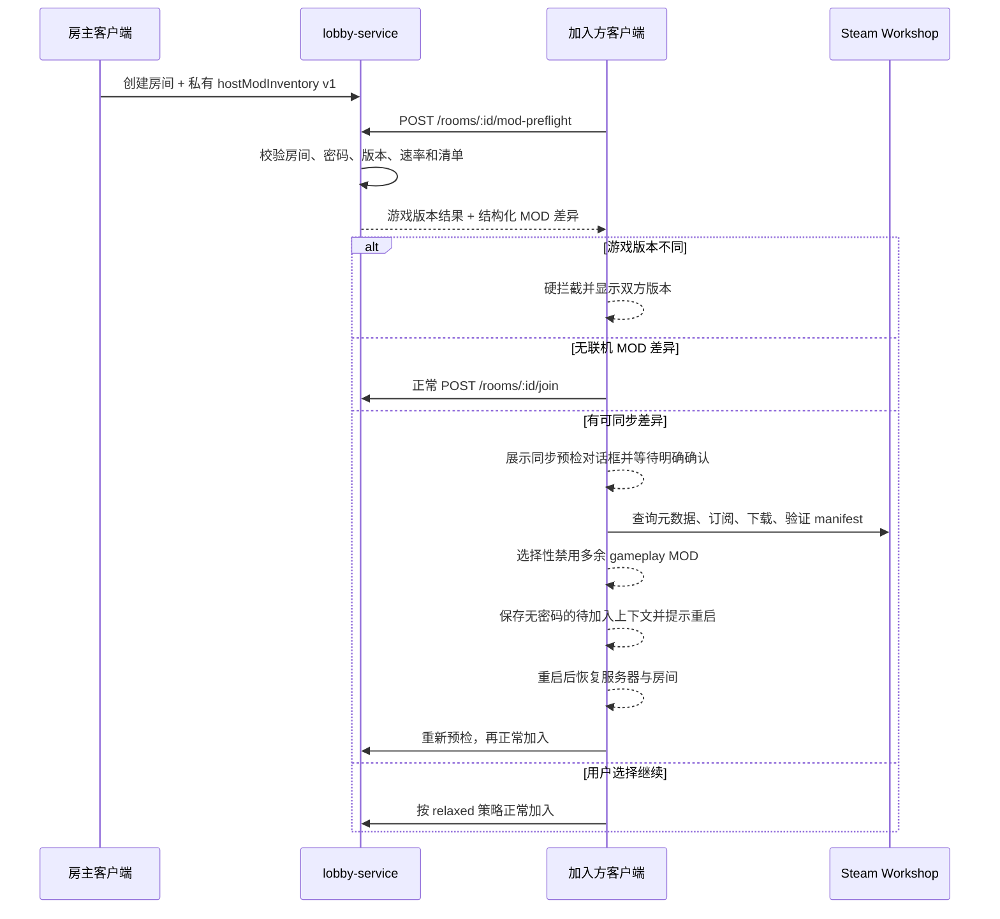

# STS2 LAN Connect v0.5.1 MOD 自动同步升级计划

> 状态：执行中（Phase 2 已通过）
>
> 基线：`main`，制定计划时 HEAD 为 `e79b6c9`
>
> 目标版本：客户端 `0.5.1` + lobby-service `0.5.1`
>
> 参考原型：[PR #38](https://github.com/emptylower/STS2-Game-Lobby/pull/38)，不得直接合并

## 1. 目标

为 LAN Connect 增加加入房间前的 MOD 兼容预检和安全同步流程：

1. 房主发布房间时生成联机相关 MOD 的结构化清单。
2. 加入方在领取连接 ticket 之前完成私有预检。
3. 对缺失的 Steam Workshop MOD 提供明确确认后的自动订阅、下载和安装进度。
4. 对加入方多出的联机相关 MOD 提供明确确认后的选择性禁用。
5. 完成同步后要求重启游戏，并在重启后恢复待加入房间。
6. 不能自动处理的平台或 MOD 提供准确的手动处理说明。
7. 保持 v0.5.0 客户端/服务端互通，不改变 relaxed 模式对非联机 MOD 的容忍边界。

“自动同步”只表示 Steam Workshop 订阅和本机 MOD 启用状态调整，不包含房主向客户端传输 DLL、PCK、ZIP 或任意 URL 文件。

## 2. 非目标

- 不允许 P2P 或 lobby-service 托管 MOD 二进制。
- 不实现任意网站下载器。
- 不支持安装指定 Workshop 历史版本；Steam 只能取得当前可用版本。
- 不热加载或热卸载 MOD；任何变更都必须重启游戏。
- 不因普通非联机 MOD 差异阻止玩家加入。
- 不把房间 MOD 清单暴露在公开 `/rooms` 列表、peer gossip 或聊天协议中。
- 不复制 AutoModSubscriber 源码。其仓库 README 声明 MIT，但当前缺少标准 `LICENSE` 文件；许可证明确前只能把行为和公开接口作为参考。

## 3. 已锁定的产品边界

### 3.1 游戏版本

- 同一房间必须使用完全相同的游戏版本。
- 游戏版本不同直接显示双方版本并中止，不进入 MOD 同步。
- 一个 v0.5.1 客户端包仍需分别加载在游戏 `0.107.1`、`0.108.0`、`0.109.0` 上。
- “单包支持多个游戏版本”不代表这些游戏版本可以互相联机。

### 3.2 MOD 范围

- 主比较集合仅包含 `affects_gameplay=true` 且当前已加载的 MOD。
- gameplay MOD 声明的必要 dependency 可以进入同步清单，即使 dependency 自身标记为非 gameplay。
- 其他非 gameplay MOD 不显示、不禁用、不影响加入。
- MOD manifest 标记可能不准确，因此 relaxed 模式必须保留“仍然尝试加入”。
- 多余 MOD 默认不勾选；禁用必须由玩家逐项选择或主动全选并二次确认。

### 3.3 平台范围

- Windows/macOS/Linux 的 Steam 运行环境支持 Workshop 自动订阅。
- Android、非 Steam 启动、SteamAPI 不可用时只显示差异和手动处理入口。
- 平台不支持时不能显示虚假的下载进度或“已完成”。

## 4. PR #38 处理结论

PR #38 只能作为交互与 AMS 适配思路参考，不能直接 cherry-pick 或 merge：

1. 叠加到当前 `main` 后无法构建，Godot 报 `GD0002`，外层类型缺少 `partial`。
2. 反射查找 `TryGet(string)`，AMS 实际接口是 `TryGet(string, out ulong)`，Workshop ID 会全部解析失败。
3. 只接管原版 `ModMismatch`，默认 `test_relaxed` 通常不会触发该弹窗。
4. 固定 5 秒停止轮询，与 AMS 最长 5 分钟状态机及 5 秒下载 kick 冲突。
5. 没有重复弹窗保护、取消、真实完成等待、平台降级或测试。
6. 固定 `720x520` 深蓝 UI 不符合当前大厅设计、移动端与无障碍要求。

实施时创建新的 `feat/mod-sync-0.5.1` 分支。最终发布说明保留对 PR 作者的创意署名，但不沿用有缺陷的实现。

## 5. 总体架构



## 6. 协议设计

### 6.1 能力版本

在 `/probe` 和客户端模型中新增：

```text
modSyncProtocolVersion: 1
modSyncEnabled: true | false
```

旧服务端缺少字段时按 `0/false` 处理。旧客户端忽略新增字段。

### 6.2 房主 MOD 描述

TypeScript 与 C# 使用同构 DTO：

```text
LobbyModDescriptor
  id: string
  version: string
  role: gameplay | dependency
  source: steam_workshop | mods_directory | unknown
  workshopFileId?: string
  dependencies: string[]
```

`workshopFileId` 必须使用十进制字符串，不能使用 JavaScript `number`，避免 `ulong` 精度丢失。

输入限制：

- 最多 64 个 descriptor。
- `id` 最长 128 字符，`version` 最长 64 字符。
- 每项最多 16 个 dependencies，每个 dependency ID 最长 128 字符。
- `workshopFileId` 只接受 1-20 位十进制数字且不能为 0。
- canonical JSON 总大小不超过 64 KiB。
- ID 去空白、去重后按 Ordinal 排序；禁止空 ID、控制字符和保留前缀。

### 6.3 私有预检接口

新增：

```text
POST /rooms/:roomId/mod-preflight
```

请求：

```text
playerName
password?
gameVersion
modSyncProtocolVersion
localMods: LobbyModDescriptor[]
```

响应：

```text
enabled
protocolVersion
gameVersion: { host, local, exactMatch }
missingWorkshopMods[]
missingManualMods[]
extraGameplayMods[]
versionMismatches[]
canContinueRelaxed
hostInventoryAvailable
```

规则：

- 预检不增加房间人数、不签发连接 ticket、不修改房间状态。
- 先经过现有 create/join 速率限制，再校验房间状态和密码；只有密码正确才返回私有清单。
- 服务端始终计算差异，即使 `STRICT_MOD_VERSION_CHECK=false`。
- 游戏版本不同始终返回不可继续状态。
- host 使用 v0.5.0、没有结构化清单时返回 `hostInventoryAvailable=false`，客户端回退现有加入逻辑。
- 正常 `/rooms/:id/join` 保持兼容，不要求旧客户端调用预检。

### 6.4 服务端存储边界

- `Room` 私有对象保存 `hostModInventory`。
- `RoomSummary`、`listRooms()`、peer snapshot、health、metrics 和聊天消息不得包含 MOD 清单。
- 日志只记录条目数量、差异分类数量和哈希，不输出完整清单或密码。

## 7. 文件与模块规划

### 7.1 客户端清单与差异

新建：

- `sts2-lan-connect/Scripts/Lobby/ModSync/LanConnectModDescriptor.cs`
- `sts2-lan-connect/Scripts/Lobby/ModSync/LanConnectModInventoryBuilder.cs`
- `sts2-lan-connect/Scripts/Lobby/ModSync/LanConnectModDiffResolver.cs`
- `sts2-lan-connect/Scripts/Lobby/ModSync/LanConnectModSyncCapabilities.cs`

修改：

- `sts2-lan-connect/Scripts/LanConnectBuildInfo.cs`
- `sts2-lan-connect/Scripts/LanConnectHostFlow.cs`
- `sts2-lan-connect/Scripts/Lobby/LanConnectLobbyModels.cs`
- `sts2-lan-connect/Scripts/Lobby/LanConnectLobbyApiClient.cs`

要求：

- 从 `ModManager.Mods` 读取明确的 manifest 字段，不再解析 `id-version` 拼接字符串作为核心数据源。
- 对 0.107.1-0.109.0 可能漂移的 MOD API 使用受约束的运行时解析，并增加 resolver 测试。
- 依赖闭包只从 gameplay 根节点向下扩展，禁止把全部非 gameplay MOD带入。
- 排除 `sts2_lan_connect` 本身和 MOD 同步协议保留项。

### 7.2 服务端

新建：

- `lobby-service/src/mod-sync/protocol.ts`
- `lobby-service/src/mod-sync/validator.ts`
- `lobby-service/src/mod-sync/diff.ts`
- 相邻 `*.test.ts`

修改：

- `lobby-service/src/config.ts`
- `lobby-service/src/app.ts`
- `lobby-service/src/store.ts`
- `lobby-service/src/store.test.ts`
- `lobby-service/src/app.integration.test.ts`
- 三份环境模板及 `lobby-service/README.md`

新增配置：

```env
MOD_SYNC_ENABLED=true
MOD_SYNC_MAX_DESCRIPTORS=64
MOD_SYNC_MAX_PAYLOAD_BYTES=65536
```

发布示例默认开启；管理面板提供持久化运行时开关。功能关闭后 `/probe` 报告 disabled，客户端无缝回退。

### 7.3 Steam 同步引擎

新建：

- `LanConnectModSyncProvider.cs`
- `LanConnectSteamWorkshopSyncProvider.cs`
- `LanConnectWorkshopJob.cs`
- `LanConnectWorkshopMetadataVerifier.cs`
- `LanConnectModDisableApplier.cs`

接口至少包含：

```text
IsAvailable
QueryMetadataAsync
SubmitAsync
Poll
Cancel
Snapshot
VerifyInstalledManifest
ApplyDisableSelection
RestorePendingDisableSelection
```

状态机：

```text
pending -> validating -> subscribing -> downloading -> waiting_install
        -> installed | failed | timed_out | canceled
```

要求：

- 长期持有 Steamworks callback，生命周期覆盖所有 job。
- 轮询直到所有 job 终态或达到 5 分钟超时，禁止固定 5 秒结束。
- 支持取消和逐项重试。
- 下载前验证 AppID 为 `2868840` 并显示 Steam 返回的真实标题/发布者。
- 安装后读取实际 manifest，验证 `id` 与预期一致；不一致视为失败。
- Workshop 当前版本与房主 MOD 版本仍不一致时必须重新预检并显示手动处理，不能宣称同步成功。
- 禁用列表默认空；写入 settings 前二次确认，全部修改成功后只调用一次 `SaveSettings()`。
- 不自动禁用 LAN Connect、必要 dependency 或 non-gameplay MOD。

### 7.4 UI

新建：

- `LanConnectModSyncDialog.cs`
- `LanConnectModSyncRow.cs`
- `LanConnectModSyncViewState.cs`
- `LanConnectModSyncLocalizer.cs`

修改：

- `LanConnectLobbyOverlay.cs`
- `LanConnectLobbyJoinFlow.cs`
- 必要的无障碍桥接和 Lucide icon 枚举

视图状态：

1. 检查中。
2. 游戏版本不匹配。
3. 完全兼容，可直接加入。
4. 可自动同步的缺失项。
5. 无法自动同步的手动项。
6. 多余 gameplay MOD 选择列表。
7. 下载进度、取消和重试。
8. 已完成，需要重启。
9. 平台不支持自动同步。

UI 要求：

- 使用当前浅色大厅 token、Lucide SVG 和现有弹窗 shell。
- 主布局使用 plain `Control` 的响应式 anchors，不使用固定 `720x520`。
- 覆盖 1280x720、1920x1080、2560x1440、4K 和 Android 纵横屏。
- 全键盘/手柄焦点、Esc、确认、取消、屏幕阅读提示完整。
- `继续加入（可能失败）` 仅在 relaxed 允许时显示，且不能作为默认主按钮。

### 7.5 重启后恢复

新建：

- `LanConnectPendingModSyncJoinStore.cs`
- `LanConnectPendingModSyncJoin.cs`

保存字段：

```text
serverBaseUrl
roomId
roomName
desiredSavePlayerNetId?
createdAtUtc
expiresAtUtc
```

不得落盘房间密码、access token、create token 或 host token。

恢复规则：

- TTL 15 分钟。
- 启动后先恢复服务器，再进入大厅并重新预检。
- 公开房间可继续；密码房重新要求输入密码。
- 使用已有 restart/rejoin in-flight lock 和 submenu debounce，禁止周期性重复打开菜单。
- 成功、取消、房间消失、过期或服务器变化后清除 pending 文件。

## 8. 分阶段执行计划

### Phase 0：基线与规格门禁

- [x] 从最新 `origin/main` 创建 `feat/mod-sync-0.5.1`，确认不包含现有未跟踪用户文件。
- [x] 把本计划中的 DTO、限制、错误码和平台矩阵转成测试名称清单。
- [x] 对 PR #38 留下 changes-requested 结论，不合并、不关闭，待替代实现完成后再处理。
- [x] 确认测试用 harmless Workshop MOD、双 Steam 账号和 0.107.1/0.108.0 测试产物来源。

Gate：范围、协议和测试夹具明确，没有实现代码。

### Phase 1：结构化清单与纯差异算法

- [x] 先写 C# descriptor、inventory、dependency closure、排序和限额失败测试。
- [x] 实现房主清单构建器及旧游戏版本运行时适配。
- [x] 先写 TypeScript validator/diff 的正常、越界、恶意字段和版本差异测试。
- [x] 实现服务端纯函数，不接 HTTP。

Gate：C#/TypeScript 对同一 fixture 产生完全一致的 canonical 差异。

建议提交：`feat(mod-sync): define canonical gameplay mod inventory`

### Phase 2：服务端私有预检

- [x] 扩展 create-room DTO 和 `Room` 私有存储，证明 `RoomSummary` 不泄露清单。
- [x] 新增预检路由、密码验证、速率限制和能力字段。
- [x] 覆盖旧 host、旧 client、feature disabled、房间关闭/已开始/密码错误。
- [x] 保持现有 join ticket 和 relay 流程不变。

Gate：服务端全量测试通过，公开 API 快照不包含 inventory。

建议提交：`feat(lobby-service): add private mod compatibility preflight`

### Phase 3：客户端加入前预检

- [x] 扩展 API 模型与 capability resolver。
- [x] 在领取 join ticket 前调用预检；旧服务端或关闭功能时回退。
- [x] 游戏版本不匹配沿用现有硬门禁。
- [x] relaxed 模式保留用户确认后的继续加入。
- [x] 为邀请、普通加入、续局重连使用同一个 preflight coordinator。

Gate：所有加入入口行为一致，v0.5.0 服务端回退测试通过。

Gate 证据（2026-07-17）：Phase 3 focused xUnit 25/25；完整 xUnit 618 通过、1 个既有双客户端原型跳过；GdUnit 219/219；客户端构建 0 警告；lobby-service check 与 425/425 测试通过。生产代码仅由 preflight coordinator adapter 领取 join ticket，缺失 capability、feature disabled 和旧 host inventory 均有回退测试。

建议提交：`feat(client): gate joins through mod compatibility preflight`

### Phase 4：Steam Workshop 与选择性禁用

- [x] 先实现 fake provider 和完整状态机测试。
- [x] 实现 Steam metadata、subscribe、download、callback、poll、timeout、cancel、retry。
- [x] 实现 manifest 安装后校验。
- [x] 实现选择性禁用、单次持久化、失败回滚和恢复提示。
- [x] SteamAPI 不可用时返回结构化 unsupported，不抛启动异常。

Gate：fake provider 全状态覆盖；真实 Steam harmless MOD 完成一次订阅、取消、失败和重试。

Gate 证据（2026-07-17）：Phase 4 focused xUnit 26/26；完整 xUnit 644 通过、1 个既有双客户端原型跳过；GdUnit 219/219；客户端构建 0 警告。真实 Steam AppID `2868840` 对 harmless 条目 `3747497501` 返回标题 `Regent FX Omnistar`，完成 `Pending -> Validating -> Subscribing -> Downloading -> Canceled`、取消订阅、Retry attempt 2 下载、受控 manifest ID 失败，以及按实际 manifest `RegentFX 0.4.3` 完成 `WaitingInstall -> Installed`。Steam 日志确认最终 unsubscribe，本机订阅和安装目录恢复；一次性 smoke runner 已删除，正常 Steam 启动无测试入口。

建议提交：`feat(client): add consent-based workshop mod synchronization`

### Phase 5：响应式 UI 与重启恢复

- [x] 实现各视图状态及本地化。
- [x] 完成下载进度、手动项、禁用选择、继续加入和取消交互。
- [x] 实现 pending join 原子写入、TTL、恢复和清理。
- [x] 复用导航锁，加入竞态回归测试。
- [x] 完成 GdUnit 固定 viewport、焦点、文本越界和像素边界测试。

Gate：桌面与 Android UI 测试通过，重启后公开房间恢复及密码房重新询问通过。

Gate 证据（2026-07-17）：Phase 5 focused xUnit 33/33；完整 xUnit 662 通过、1 个既有双客户端原型跳过；完整 GdUnit TRX 224/224；lobby-service check 与 425/425 测试通过；客户端正式构建 0 警告。真实 SubViewport 覆盖 1280x720、1920x1080、2560x1440、4K、Android 720x1280/1280x720、64 个长 MOD 行、九态重建、焦点、Esc、选择默认空和 framebuffer 像素，桌面与 Android PNG 已在临时目录人工复核且未提交。pending join 仅序列化计划允许的六个上下文字段和 schema version，15 分钟 TTL；公开房恢复后重新预检，密码房只恢复房间/角色槽并重新要求密码，旧 generation 清理不会删除新 pending。

建议提交：`feat(ui): complete mod sync dialog and restart resume flow`

### Phase 6：AMS 可选适配与安全审计

- [x] 抽象 provider 后完成决策：v0.5.1 不增加 AMS reflection adapter。
- [x] 审计完整反射签名、返回类型和参数可赋值性；AMS host sidecar map 不满足本机权威 inventory 语义，因此没有反射代码进入产品。
- [x] 生产代码不读取或写入 AMS handler，AMS 缺失、旧版或 handler 已被其他 MOD 占用均不影响原生 provider。
- [x] 完成 payload fuzz、Workshop ID 欺骗、重复 dependency、超大清单和并发预检测试。
- [x] 在 `THIRD_PARTY_NOTICES` 和 release notes 中署名 PR #38 的设计贡献。

Gate：AMS 不是 v0.5.1 发布阻塞项；原生 provider 独立完成所有核心能力。

Gate 证据（2026-07-17）：审计 AutoModSubscriber `595356c` 的公开接口，确认 `ModWorkshopMap.TryGet(string, out ulong)` 是客户端接收房主 initial info 后填充的 host sidecar map，不是本机 MOD 清单的权威来源；产品程序集无 AutoModSubscriber 引用或类型，产品源码不注册或覆盖 `ExternalDialogHandler`。Phase 6 focused xUnit 39/39、服务端安全 focused 23/23；完整 xUnit 663 通过、1 个既有双客户端原型跳过；lobby-service check 与 427/427 测试通过；完整 GdUnit TRX 224/224；客户端正式构建 0 警告。新增 576 轮受控恶意 payload 校验、Workshop ID Unicode/空白欺骗、24 路并发预检确定性与无 ticket/房间变更断言；既有测试继续覆盖 dependency 去重/环、65 项超限与 payload byte 上限。

建议提交：`fix(mod-sync): harden provider boundaries and untrusted metadata`

### Phase 7：版本、文档与完整回归

- [x] 客户端和服务端所有版本源从 `0.5.0` 升为 `0.5.1`。
- [x] 保留历史 fixture 中的 `0.5.0`、`0.4.0`、`0.2.2` 字面量。
- [x] 更新 CHANGELOG、README、客户端指南、部署指南、环境模板和发布说明。
- [x] 增加客户端与服务端包内容测试，不把游戏 DLL 或 Steamworks DLL复制进公开包。
- [x] 执行完整测试和 IL 外部成员引用对比。

Gate：完整 `verify-release.sh` 通过，两个候选包可重复生成并验证。

Gate 证据（2026-07-17）：客户端 manifest/assembly/file/informational version 与服务端 package/lock 均为 `0.5.1`，发布契约继续锁定 `0.5.0`、`0.4.0`、`0.2.2` fixture。服务端显式包清单补入 `mod-sync/diff.ts`、`protocol.ts`、`validator.ts` 三份生产文件，继续排除测试、游戏 DLL、Steamworks/Harmony/GodotSharp DLL 和非本 MOD PCK。完整 `verify-release.sh` 通过：lobby-service check 与 428/428，xUnit 663 通过及 1 个既有双客户端原型跳过，GdUnit 224/224，客户端构建 0 警告，安装 dry-run 与双包 allowlist/legal 校验通过。相对 `origin/main@66ceb72` 的 IL 审计确认新外部引用限于 Steamworks、Steam 初始化/调用结果和 MOD 设置保存；易漂移 inventory 成员仍为受约束 reflection，IL 只有 `ModManager` type token，没有 `ModManager.Mods` member call。两次独立打包目录 `diff -qr` 为空，客户端 SHA-256 `05eeb7b5318bb8d38875a328583a3ac21e8dc67ee3dbdef8ebd3549a34d9e641`，服务端 SHA-256 `cb53068e5656ba6f693a765ff16bd700f4759ba8a272f40f85bafce36acf7254`；使用 `rsync -a --checksum --delete` 同步完整 staged 镜像到 `releases/` 后再次 `diff -qr` 为空。

建议提交：`release: prepare v0.5.1 mod synchronization candidate`

### Phase 8：测试服务器、实机验收与正式发布

- [x] 使用候选 service 包部署 `ssh sub2api-tencent` 的 `/opt/sts2-lobby-test`。
- [x] 保留 `.env`、状态文件和 0.5.0 回滚包；测试节点显式开启 `MOD_SYNC_ENABLED=true`。
- [x] 验证 `/health`、`/probe`、预检隐私、房间、控制 WS、聊天和 UDP relay。
- [ ] 两台 Steam 客户端执行验收矩阵。
- [ ] Android 执行 unsupported/manual fallback 验收。
- [ ] 用户确认实测后才合并 `main`、创建 `v0.5.1` tag、上传两个新资产。
- [ ] 不覆盖 `v0.5.0` Release。

Gate：远程 main、tag、Release 资产和本地包 SHA-256 一致；测试服务重启后仍健康。

Phase 8 部分证据（2026-07-17 至 2026-07-18）：候选 service 已原子部署到 `/opt/sts2-lobby-test`，保留原 `.env`、完整旧 live tree、权限收紧的 `0.5.0` 回滚包和候选归档；服务重启后 `/health` 健康，`/probe` 返回 `modSyncProtocolVersion=1` 与 `modSyncEnabled=true`。真实测试节点 smoke 覆盖 HTTP、隐私、密码、预检、游戏版本硬拦截、控制 WebSocket、服务器/房间聊天和 UDP relay，日志未泄露 MOD 名、ID、密码或 token。0.109.0 首轮实机发现 `ModManifest.dependencies=null` 被误判为缺失成员，并确认真实 Workshop 字段为 `workshopId`；修复提交 `3f12eee`，测试隔离提交 `c6aef55` 使用只读 PE metadata 契约避免把游戏运行时污染 xUnit testhost。修复后的真实 0.109.0 验证覆盖：本机建房成功并达到 `relayState=ready`，退出后 DELETE 204；缺少 gameplay Workshop MOD 时显示真实 `Regent FX Omnistar` 元数据，取消不发 join ticket；用户确认 relaxed 后继续既有 public/relay 握手；v0.108.0 房间在任何 MOD 请求前硬拦截且无 relaxed；空 gameplay 清单在本机普通 SayTheSpire MOD 已加载时不弹提示并直接 join。

2026-07-18 使用已登录 Steam 客户端控制台从官方 macOS depot `2868842` 下载 manifest `8653035385353091849`，控制台报告 443 个文件下载完成；使用 `rsync -a --checksum --delete` 固化 `0.107.1` build `23811903` fixture 后，原始目录 `diff -qr` 为空、App 原始签名有效，`release_info.json` 为 `v0.107.1` / commit `59260271`，arm64 `sts2.dll` SHA-256 为 `e7ceb80669bfaf5c8fccabaa126ae2bb283aba514be5b5b55612579cfd285f18`。真实 metadata 证明 0.107.1 的 `Mod` 没有 0.109.0 新增的 `workshopId` 字段，但保留数字 Workshop 路径；提交 `1d7478d` 按 `release_info.json` 对 0.107.1 与 0.109.0 分别执行严格字段契约，24/24 inventory focused tests 在 0.107.1 引用下通过。最终候选逐字节安装于该 fixture 后由 Steamworks 开发 AppID 启动，达到 0.107.1 主菜单，serialization 6/6、capacity 5/5、patch groups 6/6；真实创建房间返回 `v0.107.1`、`modVersion=0.5.1`、`hostModCount=0`、`relayState=ready`，退出 DELETE 204。相同最终候选由 Steam Library 启动于真实 0.109.0，达到主菜单并得到同样的 6/6、5/5、6/6 初始化结果。官方 SteamCMD 匿名 `app_info_print 2868840` 进一步确认当前 `public` 只指向 build `23811903`，`public-beta` 只指向 build `24251656`，没有分支指向历史 build `24032229`。该 build 的 macOS manifest `1977841934321910790` 在已登录 Steam 控制台常规重试两次，并临时启用 Steam 内建 `@bClientTryRequestManifestWithoutCode=1` 精确重试一次，三次均由 manifest request ACL 返回 `Access Denied`；开关随后已恢复为 `0`。未生成或冒充 0.108.0 fixture，因此该版本 gate 仍未通过。

补充来源审计发现 Steam `content_log.txt` 记录本机曾于 2026-07-17 10:15 从官方 CDN 成功下载同一 0.108.0 manifest、完成 build `24032229` 安装并启动游戏；该时间早于本分支首个提交 17:23，不能证明 v0.5.1 候选加载。安装随后被更新覆盖，Steam staging、depotcache、HTTP cache、废纸篓与 APFS Data volume 均无可恢复的精确产物。2026-07-18 03:17 切换到本机第二个已保存 Steam 账号后精确重试同一命令，也返回 manifest request ACL `Access Denied`；测试后已恢复原账号并清空命令剪贴板。因此历史成功记录只证明官方来源曾可用，不能替代最终候选的 0.108.0 gate。

玩家测试预发布准备（2026-07-18）：在缺少 0.108.0 官方产物、第二台 Steam 客户端和 Android 实机的前提下，用户授权先发布非正式 `v0.5.1-rc.1` prerelease，让玩家与服务器运营者配套安装客户端/服务端测试包；该授权不完成 Phase 8 gate，也不允许创建正式 `v0.5.1` tag、合并 main 或覆盖 v0.5.0 Release。当前源码 HEAD `82ddc8e` 完整 `verify-release.sh` 再次通过：lobby-service 428/428、xUnit 665 通过及 1 个既有双客户端原型跳过、GdUnit 224/224、客户端构建 0 警告/0 错误和双包校验通过。两次独立 RC 构建目录 `diff -qr` 为空；相对前一候选仅 DLL 的 Git informational version 从 `258708f` 更新为 `82ddc8e`，反编译 IL `diff` 为空。RC 客户端 ZIP SHA-256 为 `3663d20e29131db9814f3e2e509befdf1e9faaa1247d8910d553c5313e4045fe`，DLL 为 `2b955c3747e3fa0982e12d2d72b7d84a4ceeab76a7607cc54c6db99bfc8dcaa2`，PCK 为 `b9907bd5a1e2afc1609d589fc3f43c9943f6f0900792ca68fafc154028720597`，服务端 ZIP 仍为 `cb53068e5656ba6f693a765ff16bd700f4759ba8a272f40f85bafce36acf7254`。完整 staged release mirror 经 `rsync -a --checksum --delete` 后 `diff -qr` 为空；客户端已通过正式安装器原子安装到本机真实 0.109.0 游戏，DLL/PCK 与 RC 包逐字节一致，App 签名有效，用户配置哈希未改变。

完整回归还暴露 server chat delivery timeout CTS 的取消/释放竞态；提交 `258708f` 统一锁内所有权，focused test 单次、连续 10 轮及该类 39/39 通过。随后完整 `verify-release.sh` 通过：lobby-service check 与 428/428，xUnit 665 通过及 1 个既有双客户端原型跳过，GdUnit 224/224，客户端构建 0 警告和双包校验通过。稳定 HEAD 两次客户端构建目录 `diff -qr` 为空，最终客户端 ZIP SHA-256 为 `3dcaef7c3c9512631ae17a866e8eed737c159122135376cc37ea509e5aae08c7`，DLL SHA-256 为 `a530726e3c767316016378bb2d4bf57ead219672983831753783333d24e87023`，PCK SHA-256 为 `b9907bd5a1e2afc1609d589fc3f43c9943f6f0900792ca68fafc154028720597`，服务端 ZIP SHA-256 仍为 `cb53068e5656ba6f693a765ff16bd700f4759ba8a272f40f85bafce36acf7254`；完整 staged release mirror 经 `rsync -a --checksum --delete` 后再次 `diff -qr` 为空。所有临时房间、SSH forward、本地 discovery、游戏进程和测试配置均已清理，用户公网配置恢复到原 SHA-256。当前 gate 仍未通过：尚缺 0.108.0 官方测试产物、第二台 Steam 客户端和 Android 设备，因此不得合并 main、创建 tag 或发布 Release。

服务器列表能力标识增量（2026-07-18）：测试节点 `http://101.35.217.99:8788` 由客户端固定注入、规范化去重并始终排在第一位；服务端在 `/probe` 和 `/peers/metrics` 声明 MOD 同步协议、运行时开关与最低客户端版本 `0.5.1`，客户端在实时协议版本至少为 1 且同步已开启时显示“支持 0.5.1+ MOD 同步”。最低客户端版本字段用于增强能力描述，不作为协议 1 已发布节点的展示硬门槛；完全未声明 MOD 同步协议的旧服务端不显示但继续兼容。TDD 覆盖空发现列表、尾斜杠去重、置顶优先级、协议 1 缺少新增最低版本字段的兼容、metrics JSON DTO、管理开关实时变化和 Godot 卡片双标识。完整 `verify-release.sh` 通过：lobby-service 433/433、xUnit 671 通过及 1 个既有双客户端原型跳过、GdUnit 226/226、客户端构建 0 警告/0 错误。客户端与服务端各两次独立打包 `diff -qr` 为空；使用 `rsync -a --checksum --delete` 同步发布镜像后再次比较为空。客户端 ZIP SHA-256 为 `151249a9bb2ee7859af48f8ebe36a4381ecbaef7e78cd52e1c86ea1746207d94`，服务端 ZIP SHA-256 为 `a8fa5a4e80ba0961d36165cdad78516adb5c94ff3f292e01d9b1cce440df288b`。该增量不改变 gameplay MOD 范围、Workshop 唯一下载来源、游戏版本硬拦截或 relaxed 边界；Phase 8 尚缺的外部实机条件仍未满足。

## 9. 测试矩阵

### 9.1 自动化

- 服务端 validator、diff、private storage、preflight、rate limit、password、privacy。
- C# inventory、dependency closure、diff、version、provider state machine、pending store。
- API 客户端 capability 降级和全部加入入口。
- GdUnit 对话框、长 MOD 名、64 项、进度、失败、键盘/手柄、Android viewport。
- 恶意 JSON、重复 ID、控制字符、超大 payload、非法 ulong、dependency 环。
- v0.5.0 client/service 双向兼容 fixture。

### 9.2 双客户端实测

1. MOD 完全一致，预检无感进入。
2. 缺少一个 Workshop gameplay MOD，订阅完成、重启、重新预检、加入成功。
3. 缺少 gameplay MOD 的 dependency，依赖一并同步。
4. 房主使用手动目录 MOD，无 Workshop ID，显示手动项。
5. 加入方多出 gameplay MOD，默认不勾选，确认后禁用并重启。
6. 只多出 non-gameplay MOD，不提示并直接加入。
7. 用户选择 relaxed 继续，保留现有握手诊断。
8. 下载取消、断网、超时、Steam callback 失败和重试。
9. Workshop 最新版本与房主版本不同，重新预检后不误报成功。
10. 游戏版本不同，直接提示且不显示 MOD 同步。
11. 密码房重启后重新询问密码，不落盘密码。
12. v0.5.0 客户端连接 v0.5.1 服务端，行为不变。

### 9.3 游戏版本

同一客户端包分别完成：

- 0.107.1 host + 0.107.1 client。
- 0.108.0 host + 0.108.0 client。
- 0.109.0 host + 0.109.0 client。
- 任意跨游戏版本组合必须在预检或握手前硬拦截。

## 10. 验证命令

```bash
cd /Users/mac/Desktop/STS2-Game-Lobby/lobby-service
npm ci
npm run check
npm run test
```

```bash
cd /Users/mac/Desktop/STS2-Game-Lobby
/Users/mac/.dotnet/dotnet test sts2-lan-connect.Tests/sts2_lan_connect.Tests.csproj -m:1
/Users/mac/.dotnet/dotnet test sts2-lan-connect.GdUnitTests/sts2_lan_connect.GdUnitTests.csproj \
  --settings sts2-lan-connect.GdUnitTests/gdunit4.runsettings -m:1
```

```bash
cd /Users/mac/Desktop/STS2-Game-Lobby
export PATH="/Users/mac/.dotnet:$PATH"
export DOTNET_ROOT="/Users/mac/.dotnet"
DOTNET_BIN=/Users/mac/.dotnet/dotnet \
GODOT_BIN="/Users/mac/Applications/Godot_mono.app/Contents/MacOS/Godot" \
  ./scripts/verify-release.sh
```

同步确定性产物时必须使用：

```bash
rsync -a --checksum --delete <staged>/ <releases>/
diff -qr <staged>/ <releases>/
```

不得依赖 `rsync -a` 的 size+mtime quick-check，因为发布脚本会标准化时间戳。

## 11. 发布与回滚

### 发布

- 新建 `v0.5.1` tag 和 GitHub Release，上传客户端与服务端两个资产。
- 先部署测试节点并完成实测，再更新公开节点。
- Release notes 明确：Steam 桌面支持自动订阅，Android/非 Steam 只支持手动引导。
- 公布“不会直接下载房主文件、不会静默禁用 MOD、必须重启”的安全边界。

### 回滚

- 服务端在管理面板关闭 MOD 同步，v0.5.1 客户端立即回退现有加入流程。
- 保留测试节点部署前压缩备份和 0.5.0 service 包。
- 客户端发生严重问题时重新指向 v0.5.0 Release，不移动或覆盖历史 tag。
- pending join 文件使用版本字段；未知版本必须忽略并清理。

## 12. 完成定义

只有同时满足以下条件才能宣称 v0.5.1 完成：

- 客户端和服务端都为 0.5.1，能力协商与旧版降级通过。
- 游戏版本不同始终硬拦截。
- 非 gameplay MOD 不参与同步或禁用。
- Steam 缺失 MOD 能在明确授权后完成订阅、真实进度、安装验证和重启恢复。
- 多余 gameplay MOD 只能由用户主动选择后禁用。
- Android/非 Steam 路径准确降级。
- 私有 MOD 清单不进入公共房间列表、日志或 peer 网络。
- 服务端、xUnit、GdUnit、三游戏版本、双客户端和发布包验证全部通过。
- 测试服务器实测通过，用户确认后完成 main、tag、Release 和资产哈希核对。

## 13. 工作纪律

- 每个 Phase 严格按“失败测试 -> 最小实现 -> focused pass -> regression pass -> commit”执行。
- Phase gate 未通过不得开始下一阶段。
- 不提交 `.omc/`、`.playwright-mcp/`、`.superpowers/`、`.env`、`dist/`、`bin/obj`、`.godot` 或游戏资产。
- 不覆盖或删除工作区内现有未跟踪 `docs/superpowers/` 文件。
- `releases/` 只从已验证的临时输出同步，不手工拼装混合产物。
- 遇到 STS2 API 漂移时使用受约束运行时适配并做 IL 引用审计，不通过简单 catch 吞掉兼容失败。
